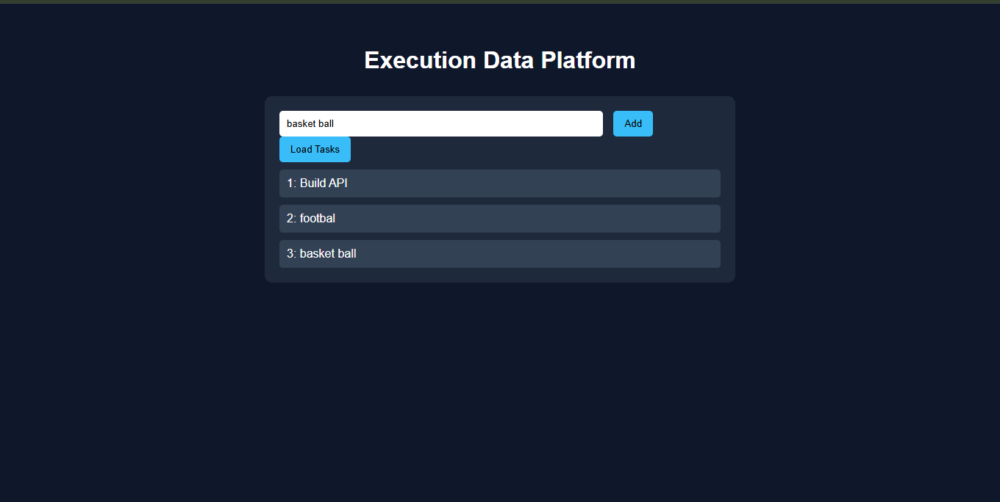
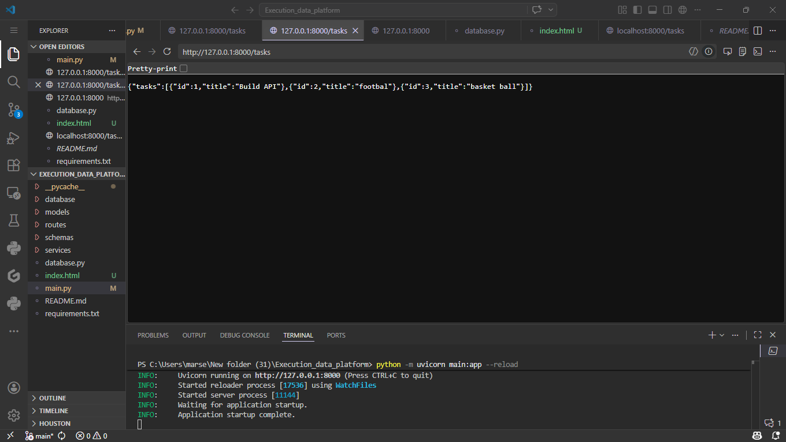

# Execution Data Platform

A backend task management and productivity platform built with FastAPI and PostgreSQL.

## Overview

Execution Data Platform is a backend-driven task management application designed to explore modern backend software engineering practices. The project demonstrates RESTful API development, relational database design, authentication, and cloud deployment using FastAPI and PostgreSQL.

The application allows users to create and manage tasks while showcasing clean API architecture and persistent data storage.

## Problem

Many productivity applications require a reliable backend capable of storing, retrieving, and managing structured task data. This project explores how such a backend can be designed using modern Python technologies while remaining lightweight and scalable.

## Solution

A FastAPI backend integrated with PostgreSQL that provides authenticated RESTful endpoints for managing task data. The project demonstrates database persistence, API documentation, modular architecture, and cloud deployment.

## Live Demo
(https://executiondataplatform-production-c903.up.railway.app/tasks)

| Technology | Purpose |
|------------|---------|
| FastAPI | Backend API |
| PostgreSQL | Database |
| SQLAlchemy | ORM |
| JWT | Authentication |
| HTML/CSS/JavaScript | Frontend |
| Railway | Deployment |
| Swagger/OpenAPI | API Documentation |

## Features

- RESTful CRUD endpoints
- JWT Authentication
- PostgreSQL database integration
- Interactive Swagger API documentation
- Cloud deployment using Railway
- Modular backend architecture

## Architecture
                 Browser
                     │
         HTML / CSS / JavaScript
                     │
              REST API Requests
                     │
                 FastAPI Server
                     │
          Authentication Layer
                     │
                PostgreSQL

##Structure
Execution_data_platform/

│

├── app/

├── routers/

├── models/

├── database/

├── static/

├── templates/

├── main.py

└── requirements.txt

## 📌 Why I built this
To demonstrate full-stack backend engineering skills, including API design, database integration, and cloud deployment.

## Screenshots
### Simple task creation UI

*Simple web UI for adding tasks and submitting them to the backend.*

### Backend data captured

*Database/backend view showing tasks captured from the UI.*

## How to Run(local)
1. Clone the repo
2. Install dependencies from `requirements.txt`
3. Run the server with `python -m uvicorn main:app --reload`
4. Open `index.html` in your browser to use the frontend

## Future Improvements
- Authentication
- Scaling data processing
- Database integration enhancements

